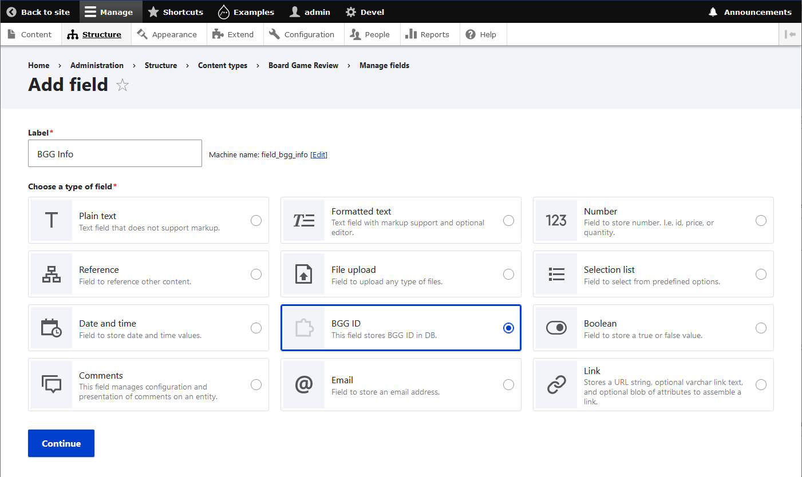
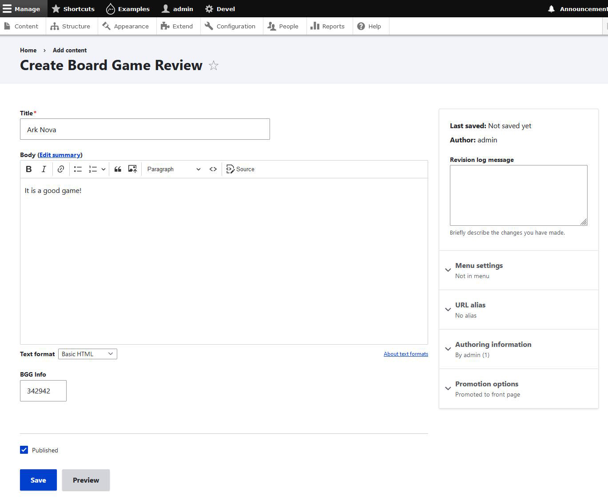
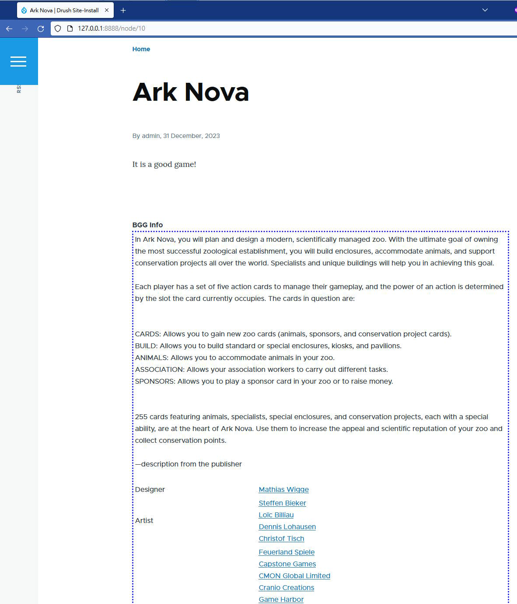
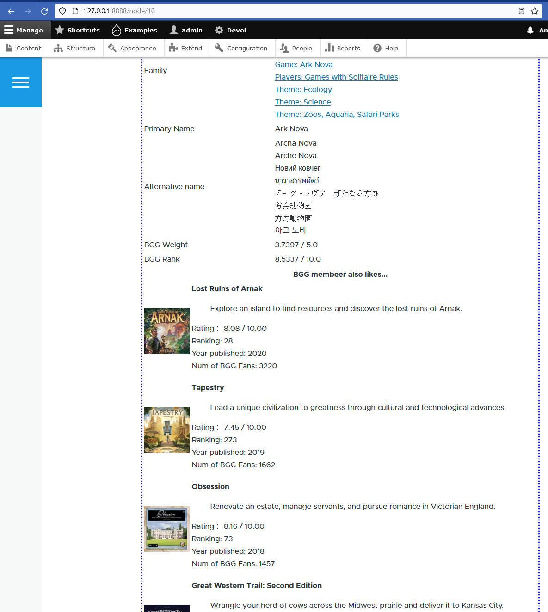
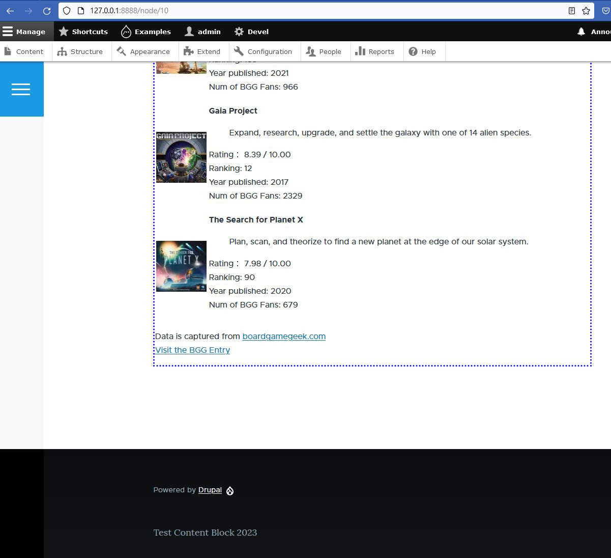

# BGG-Field-Drupal-Module
Drupal module that adds the abiality of displaying BGG data using BGGID field value

Support Drupal ^9.4 || ^10

Personal project, use as your own risk.

# Install
Place the bgg_field folder into web/modules/custom

Enable the module in the admin panel.

Create the a content type with BGG Field.

Type in the BGG ID.

# Screenshot

